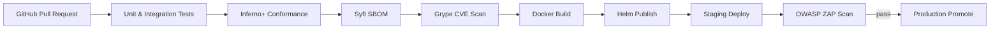

```mermaid
flowchart LR
    PR[GitHub Pull Request] --> UT[Unit & Integration Tests]
    UT --> INF[Inferno+ Conformance]
    INF --> SBOM[Syft SBOM]
    SBOM --> CVE[Grype CVE Scan]
    CVE --> DOC[Docker Build]
    DOC --> HELM[Helm Publish]
    HELM --> STAGE[Staging Deploy]
    STAGE --> ZAP[OWASP ZAP Scan]
    ZAP -->|pass| PROD[Production Promote]
```