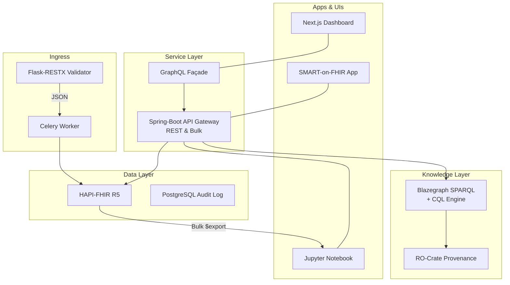

```mermaid
flowchart TD
    subgraph Apps & UIs
        A1[Next.js Dashboard]
        A2[SMART-on-FHIR App]
        A3[Jupyter Notebook]
    end
    subgraph Knowledge Layer
        K1[Blazegraph SPARQL<br/>+ CQL Engine]
        K2[RO-Crate Provenance]
    end
    subgraph Service Layer
        S1[Spring-Boot API Gateway<br/>REST & Bulk]
        S2[GraphQL Façade]
    end
    subgraph Data Layer
        D1[HAPI-FHIR R5]
        D2[PostgreSQL Audit Log]
    end
    subgraph Ingress
        I1[Flask-RESTX Validator]
        I2[Celery Worker]
    end
    I1 -->|JSON| I2 --> D1
    A1 --- S2
    A2 --- S1
    A3 --- S1
    S2 --> S1 --> D1
    S1 --> K1
    K1 --> K2
    D1 -->|Bulk $export| A3
```
