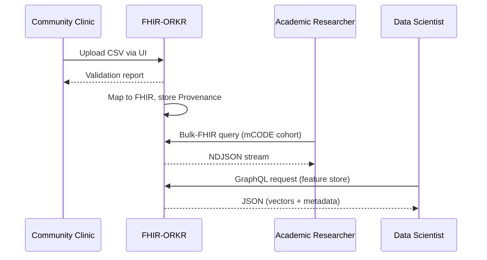

```mermaid
sequenceDiagram
    participant Clinic as Community Clinic
    participant Registry as FHIR-ORKR
    participant Researcher as Academic Researcher
    participant AI as Data Scientist

    Clinic->>Registry: Upload CSV via UI
    Registry-->>Clinic: Validation report
    Registry->>Registry: Map to FHIR, store Provenance
    Researcher->>Registry: Bulk-FHIR query (mCODE cohort)
    Registry-->>Researcher: NDJSON stream
    AI->>Registry: GraphQL request (feature store)
    Registry-->>AI: JSON (vectors + metadata)
```
